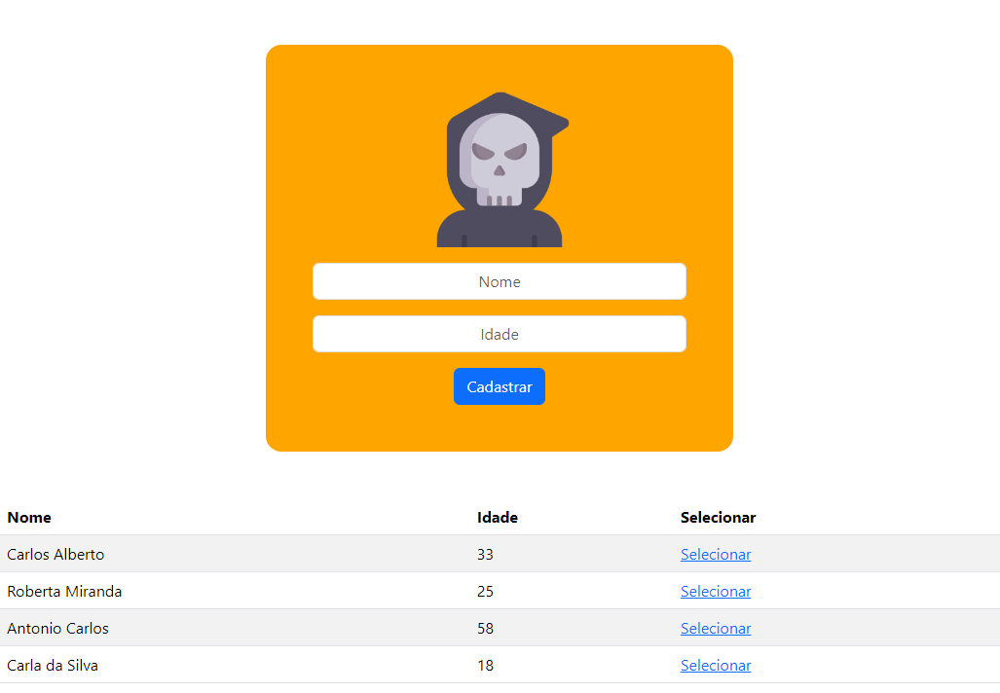
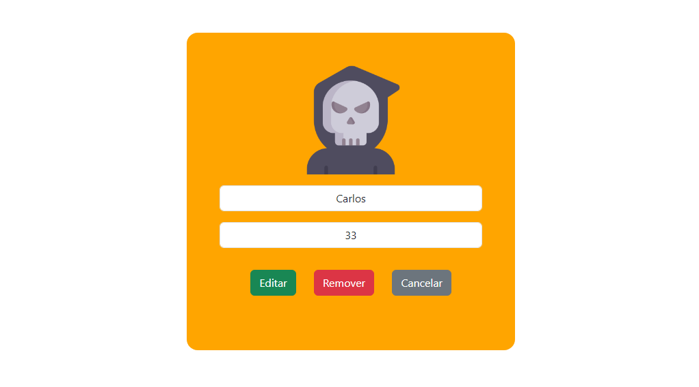

# CRUD Node

Nesse repositório é criado um CRUD(Create, Read, Update, Delete) de clientes. Os dados podem ser lidos lidos, editados e salvos diretamente em um arquivo de texto, sem necessidade de um banco de dados.

Tecnologias utilizadas:
- Node.js
- Express.js
- Bootstrap
- Express Handlebars


### Imagens da aplicação

#### Home Page


#### Edit Page


### Instruções para utilização

Instale as depedências necessárias.
```
npm install
```
Instale o nodemon para monitoramento dos arquivos do servidor.
```
npm install -g nodemon
```

Inicie o servidor do frontend e backend.
```
nodemon ./09-projeto/frontend/app.js
nodemon ./09-projeto/backend/app.js
```

Acesse a interface web através da porta.
```
localhost:3000
```
Explore!

---

### Projeto criado sob orientação do professor Ralf Lima
#### [Aprendizado inicial de Node.js - Básico, professor Ralf Lima](https://www.youtube.com/watch?v=F2cNmWNZSM0list=PLWXw8Gu52TRLBgfIclx1Nh8LA60knsxY9&index=1)

