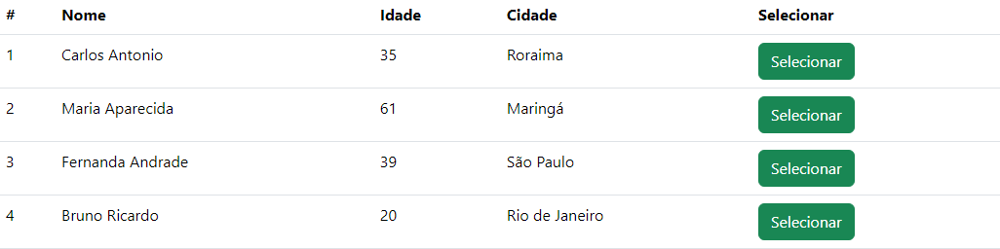

# CRUD-REACT

Nesse repositório é criado um CRUD em React, para adicionar nome, idade e cidade de usuários incluindo uma barra de pesquisa para procurar por usuários especificos. Além disso são disponibilizados botões para possibilitar as ações de adicição, alteração ou remoção usuários criados.

É explorado os conceitos de hooks, componentes e a estilização de tabelas, formulários e botões com o bootstrap.

#### Página inicial

#### Pesquisa de usuários

#### Edição de usuários

#### Remoção de usuários

